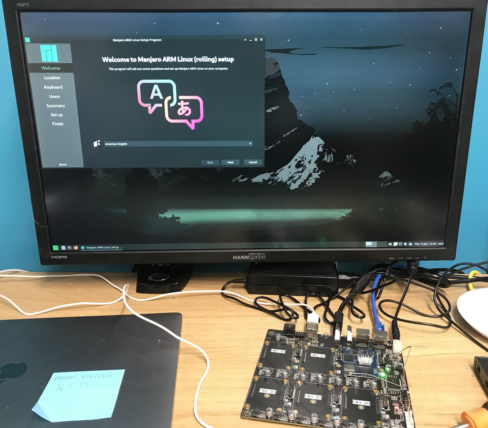

# deskpi-super6c
A repo to hold useful information and files for my exploration of the DeskPi Super6C CM4 carrier board.

The DeskPi Super6C is a mini-itx form factor (17cm x 17cm) board that hosts up to 6 compute boards
that are compatible with the RaspberryPi Compute Module 4's (CM4) form factor. These compute
boards can be mixed and matched. Each board can have an SD card and M2 2280 SSD drive on the reverse of
the carrier board. The carrier board also has a gigabit Ethernet switch built in. This makes
the Super6C board a very interesting cluster computing and edge computing board.

## The DeskPi Super6C and SOQuartz modules on my YouTube channel!

- 08 Aug 2022 - [Video introduction to the DeskPi Super6C](https://www.youtube.com/watch?v=bmKIHtm4J2g)

I also have a play list for [all things Edge Computing related](https://www.youtube.com/playlist?list=PLWoOSZbmib_cMuz7R1x2r6BmllxyFj-Ne)!

## Further board information

Details on this board can be found here:-
- [Manufacturer website](https://deskpi.com/collections/deskpi-super6c/products/deskpi-super6c-raspberry-pi-cm4-cluster-mini-itx-board-6-rpi-cm4-supported)
- Geerling Guy's [GitHub Issue](https://github.com/geerlingguy/raspberry-pi-pcie-devices/issues/336)
- [Jeff Geerling's own overview video](https://www.youtube.com/watch?v=ecdm3oA-QdQ) from 17 Aug 2022 where he created a [Ceph cluster](ceph/README.md)

I aim to explore this very interesting board and document my findings, ideas, code and links
to external sites on this repository.

## Project ideas

- [Initial OS with a custom kernel](soquartz/README.md) and configuration using Manjaro Arm and a Pine64 SOQuartz board and a spare Samsung NVMe SSD
- SSD partitioning - Can I install the OS and boot from the SSD, and use another partition for shared storage? (E.g. for a future Ceph cluster)
- [Realtek RTL8370N chip](rtl8370n/README.md) - Can I segment the network between nodes for 'physical' VLAN separation? Can I prioritise storage VLAN traffic?
- Kubernetes on Arm - Can I get microk8s or similar installed on one or more nodes? (Tanzu K8s on Arm later!)
- [Ceph on Arm](ceph/README.md) - Can I do both K8S and Ceph, so I have a general shared storage service which can also be exposed to K8S for persistent volumes?
- Bang for my buck - Can I expose the SOQuartz's Neural Processing Unit (NPU) and GPU to Linux to speed Machine Learning operations?

## Why not the Raspberry Pi?

They're like Rocking Horse Poop - super rare! I like the Pine64 hardware as I already have a
PinePhone and PinePhone Pro, so I know there are people working on the Manjaro Arm support
and Linux Kernel DTS files and drivers and I want to leverage their work. So I'm using the
[Pine64 SOQuartz CM4-compatible module](soquartz/README.md) for that.

## License and Copyright

Any documentation in this repository is distributed under the Creative Common's ShareAlike licenses v4.
All code samples are distributed under the Apache-2.0 license, unless otherwise stated.
Linux kernel code subfolders are likely GPL2 or MIT licensed - read individual files for confirmation.

Copyright Adam Fowler 2022, all rights reserved.
See individual files for specific copyright statements.
